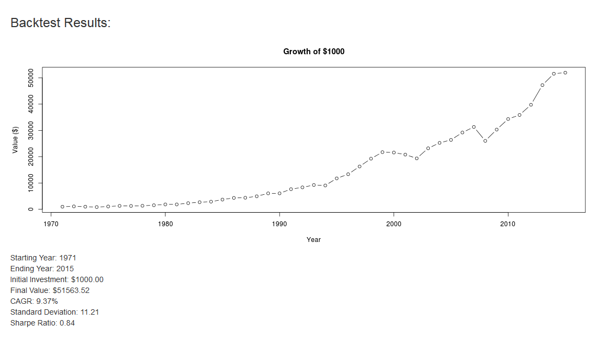

Portfolio Backtester
========================================================


Asset Allocation
========================================================
- Asset classes which are not perfectly correlated perform differently over different market conditions.
- Diversifying your investable capital should lower risk and possibly increase return over the long term.


Purpose of the Tool
========================================================

- The portfolio backtest tool is used to simulate past returns with different asset allocation strategies.
- Simulation uses $1000 invested in 1971 through 2015.
- The purpose of the tool is to help you overfit your asset allocation to the historical return data, resulting in better out of sample performance

Instructions
========================================================
- Enter allocations to each asset class in the appropriate box along left side. 
- All allocations should total to 100%. 
- Results are shown on right side of tool.
- Results are based on yearly rebalancing. 
- Simulation based on historical performance of the following mutual funds: VTSMX, VGTSX, VFITX, VGSIX, PCRIX. 

Example
========================================================
Example using equal allocation amounts (20% each):


```r
plot(year,acct_val,type="b", main="Growth of $1000", xlab="Year", ylab="Value ($)")
```

 
